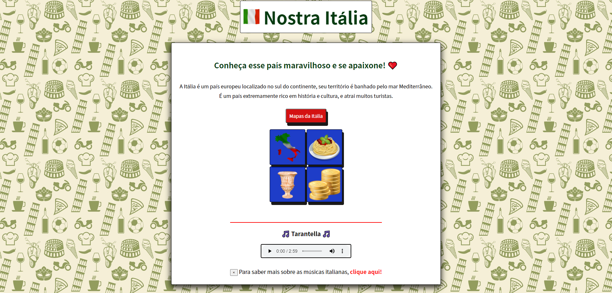
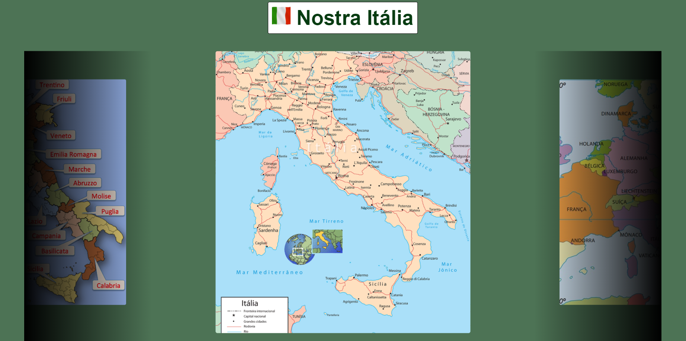

# Site sobre a Itália

 

Site responsivo feito em HTML, CSS e JavaScript.

Possui sub-páginas, botão de voltar ao topo e carrousel de imagens.

Link para o site: https://gabimesquita.github.io/Site_Italia/

