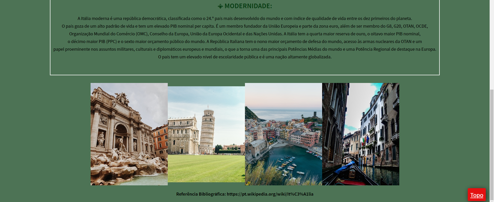

# Site Nostra Itália
 

Site responsivo feito em HTML, CSS e JavaScript.

Possui sub-páginas, botão de voltar ao topo e carrousel de imagens.

Link para o site: https://gabimesquita.github.io/Site_Italia/

## Como usar? ##
 
  

  

  

  &#xa0;

  <a href="#dart-sobre">Sobre</a> &#xa0; | &#xa0; 
  <a href="#sparkles-funcionalidades">Funcionalidades</a> &#xa0; | &#xa0;  
  <a href="#memo-licença">Licença</a> &#xa0; | &#xa0;

 

## :dart: Sobre ##

Site simples criado para portifólio próprio, com informações sobre a Itália.

## :sparkles: Funcionalidades ##

:heavy_check_mark: Botões voltar ao topo;\
:heavy_check_mark: Subpáginas;\
:heavy_check_mark: Carrossel de imagens;\

## :memo: Licença ##

Este projeto está sob licença MIT. Veja o arquivo [LICENSE](license.md) para mais detalhes.

&#xa0;

<a href="#top">Voltar para o topo</a>
